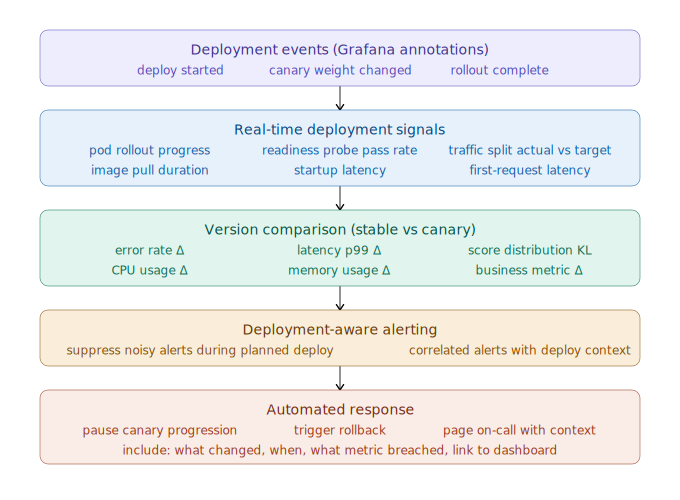

# Advanced Deployment Strategies

---

## 1. Blue-Green Deployment Strategy

Blue-Green deployment maintains **two identical production environments** — one active (serving traffic), one idle (ready for instant switchover) — enabling zero-downtime deployments and instantaneous rollback.

**Core concept:**

```
┌─────────────────────────────────────────────────────────────┐
│                  Blue-Green Architecture                    │
│                                                             │
│         Load Balancer / API Gateway                         │
│               │                                             │
│        100% traffic                                         │
│               │                                             │
│    ┌──────────▼──────────┐    ┌─────────────────────────┐   │
│    │    BLUE (active)    │    │    GREEN (idle)         │   │
│    │    v2.4.1           │    │    v2.5.0               │   │
│    │    3 replicas       │    │    3 replicas           │   │
│    │    serving users    │    │    fully deployed       │   │
│    │                     │    │    warmed up, ready     │   │
│    └─────────────────────┘    └─────────────────────────┘   │
│                                                             │
│    Switchover: router flips → GREEN becomes active          │
│    Rollback: router flips back → 30 seconds                 │
└─────────────────────────────────────────────────────────────┘
```

**Step-by-step deployment flow:**

```
Phase 1 — Deploy to idle environment:
  Green is currently serving v2.4.1
  Deploy v2.5.0 to Blue (currently receiving 0% traffic)
  Blue spins up, loads model, warms cache
  No user impact during this phase

Phase 2 — Validate Blue before switchover:
  Run smoke tests against Blue directly (bypass LB)
  Run integration tests (full API contract validation)
  Run performance benchmark (latency meets SLA?)
  Check health endpoints: /health, /ready both passing
  If any check fails → fix and redeploy to Blue (Green still serving)

Phase 3 — Switchover:
  Update load balancer rule: 100% → Blue
  Switch is atomic: one DNS/routing change
  Old Green environment still running (ready for rollback)
  Monitor metrics intensely for 15-30 minutes

Phase 4a — Stable (success):
  Metrics normal after observation window
  Scale down Green (or keep warm for rollback window)
  Green becomes the next "idle" environment for v2.6.0

Phase 4b — Issue detected (rollback):
  Flip load balancer back to Green
  Rollback complete in < 30 seconds
  Zero re-deployment required
  Investigate Blue failure without user pressure
```

**Database migration challenge:**

```
The hardest part of blue-green: schema changes

Wrong approach (causes failures during switchover):
  Deploy Green v2.5.0 with new DB schema
  Switchover → Blue (v2.4.1) now reading schema it doesn't understand
  → Errors during rollback window

Right approach — Expand-Contract pattern:
  Phase 1 (Expand): Add new column, keep old column
    Both Blue (v2.4.1) and Green (v2.5.0) work with both columns

  Phase 2: Switchover to Green
    Green writes to both old and new columns
    Rollback to Blue still works (old column still present)

  Phase 3 (Contract): After rollback window passes
    Remove old column
    Green only writes to new column

  Critical rule: never make breaking DB changes during switchover window
```

**Blue-Green for ML models (specific considerations):**

```
Model warm-up time matters:
  ML models often require warm-up before serving fast predictions:
  ├── GPU: CUDA context initialization (10-30 seconds)
  ├── JVM-based models: JIT compilation warm-up
  └── Cache warming: first N predictions are slow (cold start)

  Solution: warm-up before routing any traffic to Green
  Readiness probe: run 100 warm-up inferences → mark ready
  Only then does load balancer route to Green

Model state synchronization:
  Online feature store: both Blue and Green must read same data
  Prediction cache: warm up Green cache before switchover
  A/B test assignments: persist user-to-variant mapping across switch
```

---

## 2. Canary Deployment Strategy

Canary deployment **gradually shifts traffic** from the stable version to the new version — exposing the new version to a small percentage of real users first, expanding only if metrics remain healthy.

**Traffic progression:**

```
Deploy day (hour 0):
  Stable v2.4.1: ████████████████████  100%
  Canary  v2.5.0: (not yet deployed)

Hour 1 — Canary at 1%:
  Stable v2.4.1: ███████████████████░   99%
  Canary  v2.5.0: ░                      1%
  → Watch: error rate, latency p99

Hour 2 — Canary at 10%:
  Stable v2.4.1: ██████████████████     90%
  Canary  v2.5.0: ██                    10%
  → Watch: business metrics, user complaints

Hour 4 — Canary at 25%:
  Stable v2.4.1: ███████████████        75%
  Canary  v2.5.0: █████                 25%
  → Watch: infrastructure load, saturation

Hour 8 — Canary at 50%:
  Stable v2.4.1: ██████████             50%
  Canary  v2.5.0: ██████████            50%
  → Full statistical confidence window

Hour 24 — Canary at 100%:
  Stable v2.4.1: (scaled down, kept for rollback)
  Canary  v2.5.0: ████████████████████ 100%
```

**Automated canary analysis — what to measure:**

```
Infrastructure metrics (measured continuously):
├── Error rate: canary vs stable within ±0.1%
├── Latency p99: canary within 10% of stable
├── Success rate: canary ≥ 99.9%
└── Resource usage: CPU/memory within expected range

ML-specific metrics (measured per canary step):
├── Prediction score distribution: similar to stable (KL divergence)
├── Prediction confidence: not systematically lower than stable
├── Feature coverage: no increase in missing feature rate
└── Null prediction rate: < 0.01% (model returning no output)

Business metrics (measured with longer window):
├── Conversion rate per predicted-positive: stable or better
├── User engagement: no significant drop
├── False positive rate (if labels arrive quickly): within threshold
└── Revenue per prediction: not degrading

Canary gate logic:
  At each traffic step:
  IF all metrics within threshold for minimum observation window:
    → Proceed to next traffic percentage
  IF any metric breaches threshold:
    → Halt progression
    → Alert on-call
    → Human decides: fix and retry OR rollback
  IF critical metric breached (error spike, crash):
    → Immediate auto-rollback (no human needed)
```

**Canary vs Blue-Green selection:**

```
┌──────────────────┬─────────────────────┬────────────────────┐
│                  │    Blue-Green       │    Canary          │
├──────────────────┼─────────────────────┼────────────────────┤
│ Risk exposure    │ 0% until switchover │ 1% → 100% gradual  │
│ Rollback speed   │ < 30 seconds        │ 1-2 minutes        │
│ Infra cost       │ 2x during deploy    │ Small overhead     │
│ Validation       │ Pre-switchover only │ Real production    │
│ Blast radius     │ Sudden (100% flip)  │ Controlled (1-10%) │
│ Best for         │ High-risk changes   │ Normal releases    │
│ Complexity       │ Medium              │ Higher             │
└──────────────────┴─────────────────────┴────────────────────┘
```

---

## 3. Progressive Delivery Concepts

Progressive delivery is the **umbrella discipline** that extends Continuous Delivery with controlled, observable rollout mechanisms — treating deployment as a multi-stage process with automated validation gates at each stage.

**Progressive delivery framework:**

```
Traditional CD:                  Progressive Delivery:
Code → Test → Deploy 100%        Code → Test → Deploy 1%
                                            → Analyze
                                            → Deploy 10%
                                            → Analyze
                                            → Deploy 50%
                                            → Analyze
                                            → Deploy 100%
                                  or
                                            → Rollback

Progressive delivery = Continuous Delivery + controlled exposure
```

**Progressive delivery techniques (spectrum):**

```
Most conservative ────────────────────────────── Fastest

Shadow    Blue-Green   Ring      Canary    Feature    Dark
Deploy    Switchover   Deploy    Rollout   Flags      Launch

Shadow: new version sees all traffic, results not served
Blue-Green: instant full switchover after validation
Ring: internal → beta → general availability phases
Canary: gradual % increase with metric gates
Feature flags: instant toggle without redeployment
Dark launch: feature built, deployed but disabled
```

**Argo Rollouts — Kubernetes-native progressive delivery:**

```
Rollout resource replaces standard Deployment:

spec:
  strategy:
    canary:
      canaryService: payment-api-canary    ← canary endpoint
      stableService: payment-api-stable    ← stable endpoint
      trafficRouting:
        istio:
          virtualService:
            name: payment-api-vsvc
      steps:
      - setWeight: 5                       ← step 1: 5% traffic
      - pause: {duration: 10m}             ← wait 10 min
      - analysis:                          ← run metric analysis
          templates:
          - templateName: success-rate
      - setWeight: 20                      ← step 2: 20% traffic
      - pause: {duration: 30m}
      - analysis:
          templates:
          - templateName: success-rate
          - templateName: latency-p99
      - setWeight: 50
      - pause: {duration: 1h}
      - setWeight: 100                     ← full rollout

AnalysisTemplate defines what "healthy" means:
  success-rate:
    provider: prometheus
    query: |
      sum(rate(http_requests_total{status="200"}[5m]))
      /
      sum(rate(http_requests_total[5m])) > 0.999
    failureLimit: 3
```

---

## 4. Traffic Splitting Techniques



Traffic splitting is the **mechanical layer** of progressive delivery — the actual mechanisms that route specific percentages or segments of traffic to different service versions.**Implementation layers for traffic splitting:**

```
DNS-level splitting:
  Weighted DNS records route to different load balancers
  Coarse-grained (5-10% minimum granularity)
  No session stickiness
  Best for: geographic splits

Load balancer splitting (L4/L7):
  Nginx upstream weights, ALB weighted target groups
  Request-level granularity
  No application logic required
  Best for: weight-based canary at infrastructure level

Service mesh splitting (Istio VirtualService):
  Fine-grained: 0.1% granularity
  Header, cookie, user-ID based routing
  mTLS preserved through split
  Best for: sophisticated canary + A/B in Kubernetes

Application-level splitting (feature flags):
  Arbitrary logic in code
  User cohort, plan type, account age, geographic
  Instant change (no redeploy needed)
  Best for: business logic splits, ML model experiments
```

---

## 5. Feature Flags for ML Systems

Feature flags allow **decoupling deployment from release** — new model code is deployed but not activated, enabling instant toggles without redeployment and sophisticated targeting.

**Feature flag types for ML:**

```
Kill switch (circuit breaker):
  if feature_flag("use-new-churn-model"):
    return new_model.predict(features)
  else:
    return fallback_model.predict(features)  ← instant disable
  
  Use case: new model deployed, disable if issues emerge
  Toggle: single flag flip → no redeploy

A/B gate (percentage rollout):
  experiment = flag_sdk.get_variant("churn-model", user_id)
  if experiment == "v2.5":
    return model_v25.predict(features)
  elif experiment == "v2.4":
    return model_v24.predict(features)
  
  Use case: controlled exposure with user-level assignment
  Toggle: adjust % in flag system → takes effect immediately

Targeting (cohort-based):
  context = {
    "user_plan": user.plan,
    "account_age_days": user.tenure,
    "country": user.country
  }
  if flag_sdk.is_enabled("new-fraud-model", context):
    return fraud_model_v2.predict(features)
  
  Use case: roll out to premium users first, then expand
  Toggle: change targeting rules → no code change

Operational (infrastructure toggle):
  if feature_flag("use-gpu-inference"):
    return gpu_model_session.run(input)
  else:
    return cpu_model_session.run(input)
  
  Use case: route to GPU or CPU based on availability/cost
```

**Feature flag lifecycle for ML:**

```
Dark launch (code deployed, flag off for all):
  → Model loaded into memory, not yet serving
  → Validate loading, warm-up, health checks
  → Zero user impact

Internal release (flag on for employees only):
  → Internal team uses new model in production
  → Catch obvious regressions with real data
  → No customer exposure

Beta release (flag on for opted-in users):
  → Collect feedback from willing participants
  → Real quality signal without broad exposure

Gradual rollout (percentage ramp):
  5% → validate → 25% → validate → 100%
  Each step: metric analysis before proceeding

General availability (flag on for all):
  → Flag removed from code in follow-up cleanup
  → Old code path deleted
  → Model version promoted to stable in registry
```

**Flag system integration with ML observability:**

```
Every prediction must log which flag variant was served:
{
  "prediction": 0.74,
  "model_version": "2.5.0",
  "flag_variant": "new-churn-model-v2",
  "user_cohort": "premium-us",
  "experiment_id": "churn-model-rollout-jan"
}

This enables:
├── Filter metrics by flag variant (compare A vs B)
├── Business metric analysis per experiment arm
├── Rollback to previous flag state if degradation detected
└── Automatic flag disable when error rate threshold breached
```

---

## 6. Model A/B Testing Strategy

Model A/B testing runs **two or more model versions simultaneously on real traffic** to determine which performs better on business metrics — not just validation metrics.

**Why A/B testing beyond offline evaluation:**

```
Offline evaluation (validation set):
  Model A: val_AUC = 0.921
  Model B: val_AUC = 0.943  ← B wins offline

A/B test in production (real business outcome):
  Model A: 14.2% actual churn rate reduction (from actions taken)
  Model B: 12.8% actual churn rate reduction  ← A wins online!

Why the reversal?
  Model B is more conservative (predicts less churn)
  Fewer interventions triggered → lower conversion cost
  But also fewer true churners caught → worse business outcome
  Offline AUC doesn't capture this real-world effect
```

**A/B test experimental design:**

```
Pre-experiment planning (critical, do this first):

Define primary metric:
  "30-day customer retention rate among predicted churners"
  NOT "model AUC" (that's an ML metric, not business metric)

Define guardrail metrics (must not worsen):
  "false positive rate" → don't flood CRM with wrong predictions
  "prediction latency p99" → don't degrade user experience
  "error rate" → model must be stable

Define minimum detectable effect:
  "We care if retention rate changes by ≥ 0.5%"
  Anything smaller is business-irrelevant

Calculate required sample size:
  Sample size = f(effect size, significance level, power)
  With: MDE = 0.5%, α = 0.05, power = 0.80
  → Need ~50,000 predictions per arm before deciding

Commit to experiment duration before starting:
  Based on sample size calculation: 14 days minimum
  No peeking and stopping early (inflates false positive rate)
```

**A/B test execution for ML:**

```
Traffic assignment (must be consistent per user):
  user_id hash → deterministic arm assignment
  Same user always sees same model during experiment
  Prevents within-user variance from polluting results

Holdout group structure:
  Control (Model A, stable): 45% of users
  Treatment (Model B, new): 45% of users
  Holdout (no model, baseline): 10% of users
  → Holdout measures: value of ML vs no ML at all

Label collection and joining:
  Prediction made: user_id=123, model=B, timestamp=T
  Outcome observed: user_id=123, churned=false, timestamp=T+30d
  Join on user_id → compute per-user business outcome
  Aggregate by experiment arm → compare A vs B

Statistical analysis:
  t-test or Mann-Whitney U (continuous metrics)
  Chi-squared test (conversion rate, binary outcomes)
  Always report: effect size, confidence interval, p-value
  Practical significance ≥ statistical significance
  "Statistically significant 0.01% improvement" → not worth deploying
```

---

## 7. Shadow Deployment

Shadow deployment runs **the new model version alongside production without serving its predictions to users** — gaining confidence with real traffic patterns and real feature distributions before actual exposure.

**Shadow mode architecture:**

```
                 Production Request
                        │
            ┌───────────┴───────────┐
            │                       │
            ▼                       ▼ (async copy)
     Stable model              Shadow model
     (v2.4.1)                  (v2.5.0)
            │                       │
            ▼                       ▼
    Prediction served         Prediction logged
    to user                   (NOT served to user)
    response: 0.74            logged: 0.71
            │                       │
            └──────────┬────────────┘
                       ▼
              Prediction comparison log:
              {
                user_id: "u123",
                stable_score: 0.74,
                shadow_score: 0.71,
                delta: -0.03,
                features_hash: "abc123"
              }
```

**What shadow testing validates:**

```
Technical validation (immediate):
├── Does new model load and serve without errors?
├── Does latency meet SLA? (p99 < 100ms)
├── Are all features accessible from feature store?
├── Are predictions in valid range? (0.0–1.0)
└── Memory and CPU usage within acceptable limits

Distribution validation (after days of data):
├── Score distribution: similar shape to stable model
│   KL divergence between score histograms < threshold
├── Prediction class balance: similar positive rate
├── High-confidence predictions: both models agree on easy cases
└── Disagreement analysis: where do they differ and why?

Coverage validation:
├── Feature null rate at inference time
├── New categories in categorical features
└── Out-of-distribution inputs handled gracefully

Anti-patterns shadow testing catches:
├── Training-serving skew: features computed differently offline vs online
├── Data leakage: feature only available in training, not serving
├── Encoding mismatches: one-hot order different between train and serve
└── Threshold calibration issues: raw score distribution shifted
```

**Shadow analysis report:**

```
After 7 days of shadow traffic:

Agreement rate: 94.2%   ← where both models predict same class
  High agreement → safe to promote
  Low agreement (<90%) → investigate differences first

Score distribution comparison:
  Stable p50: 0.31, Shadow p50: 0.34  (similar)
  Stable p99: 0.82, Shadow p99: 0.79  (similar)
  KL divergence: 0.04  (< 0.1 threshold → healthy)

Disagreement cases (5.8% of predictions):
  Stable HIGH / Shadow LOW: 2.1%  ← shadow less sensitive
  Stable LOW / Shadow HIGH: 3.7%  ← shadow more aggressive
  
Latency comparison:
  Stable p99: 42ms, Shadow p99: 51ms  ← shadow slightly slower
  Within SLA (< 100ms) ✅

Decision: proceed to canary (1% traffic)
  Monitor latency carefully (shadow is 21% slower than stable)
```

---

## 8. Automated Rollback Mechanisms

Automated rollback removes the **human latency from incident response** — when a deployment degrades production metrics, the system reverts automatically without waiting for a human to notice, assess, and act.

**Rollback trigger hierarchy:**

```
Tier 1 — Hard triggers (immediate, no human required):
  Condition: any of these for 2+ consecutive minutes
  ├── HTTP 5xx error rate > 5%
  ├── Inference latency p99 > 5× SLA
  ├── Pod crash loop (CrashLoopBackOff)
  ├── Null prediction rate > 0.5%
  └── OOM kills > 2 in 5 minutes
  
  Action: immediate 100% traffic to previous stable version

Tier 2 — Soft triggers (metric degradation, confirm before rollback):
  Condition: sustained for 10+ minutes
  ├── Error rate increased > 1% vs baseline
  ├── Latency p99 increased > 50% vs baseline
  ├── Business metric declined > 3% vs control group
  └── Prediction distribution KL divergence > 0.3
  
  Action: halt canary progression + page on-call
  Human decides: rollback or investigate

Tier 3 — SLO triggers (budget burn):
  Condition: error budget burn rate > 14.4×
  Action: page on-call immediately, prepare rollback
  Human decides within 30 minutes
```

**Automated rollback implementation (Argo Rollouts):**

```
AnalysisTemplate defines health criteria:
  success-rate:
    provider: prometheus
    query: rate(http_requests{status="200"}[2m])
           /
           rate(http_requests_total[2m])
    successCondition: result[0] >= 0.999
    failureLimit: 3              ← fail 3 times = rollback
    interval: 60s                ← check every minute

Rollout connects analysis to traffic steps:
  steps:
  - setWeight: 10
  - analysis: success-rate       ← runs during 10% canary
  - setWeight: 50
  - analysis: [success-rate, latency-p99]

If analysis fails:
  Rollout enters Degraded state
  Traffic automatically reverted to stable ReplicaSet
  Alert fired to on-call with rollback reason
  Canary pods scaled to 0 (not deleted — available for debugging)
```

**Rollback execution time targets:**

```
Blue-Green rollback:
  Mechanism: load balancer rule flip
  Time: 10-30 seconds (DNS TTL or routing update)
  User impact: zero (traffic switches atomically)

Canary rollback (Argo Rollouts / Istio):
  Mechanism: VirtualService weight update
  Time: 30-60 seconds (config propagation)
  User impact: canary users (~10%) see rollback

K8s rolling rollback:
  kubectl rollout undo deployment/payment-api
  Mechanism: starts new rollout with previous image
  Time: 2-5 minutes (pods replace one by one)
  User impact: brief degradation during pod replacement

GitOps rollback:
  git revert <merge-commit> + push
  Mechanism: ArgoCD detects change, reconciles cluster
  Time: 3-5 minutes end-to-end
  User impact: same as K8s rolling rollback
  Advantage: full audit trail, version-controlled rollback
```

---

## 9. Zero-Downtime Deployment Design

Zero-downtime deployments require **every component in the stack** to be designed for it — a deployment that skips any one principle will cause at least some users to experience errors.

**Zero-downtime requirements checklist:**

```
Application level:
├── Graceful shutdown: handle SIGTERM → finish in-flight → exit
│   Default K8s: SIGTERM → 30s grace period → SIGKILL
│   App must: stop accepting new connections on SIGTERM
│             drain existing connections
│             complete in-flight requests
│             exit cleanly
│
├── Readiness probe: only receive traffic when truly ready
│   ML model: not ready until model loaded + warm-up complete
│   DB: not ready until connection pool established
│   Dependency check: not ready until feature store reachable
│
└── Health check endpoint: returns 503 during startup/shutdown
    Kubernetes removes pod from service endpoints on 503

Infrastructure level:
├── Rolling update strategy: maxUnavailable=0, maxSurge=1
│   Always have full capacity before removing old pods
│   Never scale down before scale up
│
├── PodDisruptionBudget: minAvailable=N-1 (at least N-1 pods always running)
│   Prevents voluntary disruptions from removing too many pods
│
└── Preemption prevention: terminationGracePeriodSeconds > request timeout
    Give pod enough time to drain connections

Database level (hardest part):
├── Migrations must be backward compatible (expand-contract)
├── New column added before code that uses it deployed
├── Old column kept until all old code versions retired
└── No destructive schema changes during active deployment

Load balancer / service mesh level:
├── Connection draining: wait for in-flight requests before removing pod
├── Retry budget: brief errors during transition retried automatically
└── Circuit breaker: fail fast if too many errors, don't queue
```

**Graceful shutdown sequence for ML services:**

```
SIGTERM received by inference pod:

t=0s:   Readiness probe starts returning 503
        Load balancer stops sending new requests to this pod
        
t=0-5s: Pod finishes any in-flight inference requests
        Returns all pending predictions
        
t=5s:   Release connection pool (database, feature store)
        Flush prediction log buffer to Kafka
        
t=10s:  Release GPU memory (if GPU pod)
        Release model from memory
        
t=15s:  Pod exits cleanly (exit code 0)
        
t=30s:  If still running → SIGKILL (safety net)
        Should never reach this with proper graceful shutdown
```

---

## 10. Scaling Strategies (Horizontal & Vertical)

```
Two fundamental scaling directions:

Horizontal scaling (scale out):
  Add MORE pods/nodes running the same service
  ├── No single point of failure
  ├── Linear cost scaling
  ├── Works for stateless services (most ML serving)
  └── Requires load balancing to distribute traffic

Vertical scaling (scale up):
  Give EXISTING pods MORE resources (CPU, memory, GPU)
  ├── Simple (no architecture change)
  ├── Limited by largest available machine
  ├── Brief downtime during pod resize (in K8s)
  └── Good for: memory-bound workloads, GPU models
```

**Horizontal Pod Autoscaler (HPA) for ML:**

```
Scale triggers for ML services:

CPU-based (reactive, default):
  Scale up when CPU > 70% across all pods
  Works for: CPU-bound inference, preprocessing

Memory-based:
  Scale up when memory > 80%
  Works for: large embedding models, transformer serving

Custom metrics (most useful for ML):
  Request queue depth:
    If queued_requests > 50 → scale up (reduce wait time)
  
  Requests per second per pod:
    If RPS > 100/pod → scale up
    If RPS < 20/pod for 5 min → scale down
  
  GPU utilization:
    If GPU > 85% → scale up (add more GPU pods)
    If GPU < 20% for 10 min → scale down (save cost)

HPA config for inference service:
  minReplicas: 3         ← always 3 (HA: one per AZ)
  maxReplicas: 50        ← upper bound (cost + capacity)
  scaleUpPolicy:
    stabilizationWindow: 30s   ← scale up fast (traffic spikes)
    rate: 4 pods per 60s
  scaleDownPolicy:
    stabilizationWindow: 300s  ← scale down slow (don't thrash)
    rate: 1 pod per 60s
```

**KEDA — event-driven autoscaling:**

```
Scale to zero (no traffic → 0 pods, instant scale-up on demand):
  Batch inference workers:
    ScaledObject triggers on: Kafka topic lag
    lag = 0 → 0 workers (save cost completely)
    lag > 0 → scale up immediately (process the batch)
    
  GPU inference:
    Scale to zero overnight (0 GPU cost)
    Scale up when traffic resumes (with warm-up consideration)

Kafka queue scaler:
  triggers:
  - type: kafka
    metadata:
      topic: prediction-requests
      lagThreshold: "10"          ← 1 worker per 10 queued items
      consumerGroup: inference-workers

Result: batch inference workers scale precisely with workload
        zero idle cost on evenings/weekends
```

**Vertical Pod Autoscaler (VPA) for right-sizing:**

```
VPA analyzes historical resource usage:
  Observed: model uses 0.3 CPU on average, spikes to 1.2
  Requests set at: 0.25 CPU (under-provisioned)
  Limits set at: 5 CPU (over-provisioned, wasteful)

VPA recommends:
  requests.cpu: 0.5    ← covers average + buffer
  limits.cpu: 1.5      ← covers spikes without waste
  requests.memory: 1.5Gi
  limits.memory: 2Gi

VPA modes:
  Off:     Just recommend, don't apply (safe to start)
  Initial: Apply only at pod creation (no restarts)
  Auto:    Apply and restart pods when needed (risky for prod)

Best practice: use VPA in "Off" mode initially
  Review recommendations weekly
  Apply manually during low-traffic periods
  Graduate to "Initial" mode after stable for 30 days
```

---

## 11. Load Testing Concepts

Load testing validates that **the deployment can handle expected (and unexpected) traffic levels** before those levels arrive in production with real user impact.

**Load testing taxonomy:**

```
Load Test (expected peak):
  Simulate normal peak traffic
  Goal: verify performance meets SLA at expected load
  Duration: 30-60 minutes at peak
  Example: 1000 RPS (2× current traffic peak)

Stress Test (find the breaking point):
  Gradually increase load until failure
  Goal: find system capacity limits
  Shape: ramp 0 → 500 → 1000 → 2000 → 5000 RPS
  Learn: at what load does latency degrade? Error rate spike?

Spike Test (sudden traffic burst):
  Sudden jump from baseline to extreme load
  Goal: test autoscaling responsiveness and graceful degradation
  Shape: 100 RPS → instant 5000 RPS → back to 100 RPS
  Learn: does HPA scale fast enough? Do requests queue or fail?

Soak Test (sustained load over time):
  Run at moderate load for 24-72 hours
  Goal: find memory leaks, connection pool exhaustion, gradual degradation
  Example: 500 RPS constant for 48 hours
  Learn: does performance degrade over time? Resource exhaustion?

Breakpoint Test (specific failure mode):
  Test a specific scenario until it breaks
  Example: flood feature store → verify circuit breaker activates
  Learn: do protection mechanisms work at scale?
```

**ML-specific load test scenarios:**

```
Scenario 1 — Cold start:
  0 pods running (scaled to zero)
  Fire 1000 requests simultaneously
  Measure: time to first response, error rate during scale-up
  Acceptable: < 5% errors during 30-second scale-up window

Scenario 2 — Large batch requests:
  Send batches of 500 records each
  Measure: memory usage, latency per record vs single inference
  Goal: batch efficiency 5× better than individual requests

Scenario 3 — Feature store degradation:
  Throttle feature store response time to 200ms
  Measure: impact on p99 inference latency
  Goal: feature store latency adds linearly, no cascading delay

Scenario 4 — GPU memory pressure:
  Send concurrent requests that fill GPU memory
  Measure: queueing behavior, error rate
  Goal: graceful backpressure, not OOM kill

Scenario 5 — Diverse input distributions:
  Send inputs covering full range of feature values
  Include: nulls, edge cases, extreme values
  Measure: prediction validity, no crashes on edge inputs
```

**Load test results interpretation:**

```
Latency curve shape tells the story:

Healthy (resources not saturated):
  RPS: 100 → 500 → 1000 → 2000
  p99: 45ms → 46ms → 48ms → 52ms
  Linear, slight increase only → have capacity headroom

Approaching saturation:
  RPS: 100 → 500 → 1000 → 2000
  p99: 45ms → 50ms → 80ms → 250ms
  Steep curve starts → queue forming, approaching bottleneck

Saturated (system at limit):
  RPS: 100 → 500 → 1000 → 1200
  p99: 45ms → 60ms → 300ms → 5000ms (or errors)
  At 1200 RPS system can't keep up → queue grows unbounded

Action from results:
  Healthy at 2× peak: production-ready
  Bottleneck at 1.5× peak: optimize before peak season
  Bottleneck at <1× peak: block release until fixed
```

---

## 12. Chaos Engineering Basics

Chaos engineering is the **discipline of intentionally injecting failures** into a system to discover weaknesses before they manifest during real incidents.

**Chaos engineering philosophy:**

```
Traditional approach:
  "We think our system is resilient"
  "Our runbooks say it handles X failure"
  → Discovery: it doesn't, during an incident at 3am

Chaos engineering approach:
  "We'll prove our system handles X failure"
  "We'll inject X failure in a controlled way"
  "We'll measure real behavior, not assumed behavior"
  → Discovery: it doesn't, during a planned experiment at 2pm
  → Fix it before real incident occurs

Chaos hypothesis format:
  "We believe [the system] can tolerate [this failure]
   evidenced by [these metrics staying within bounds]"
  
  Example:
  "We believe inference-service can tolerate
   loss of one AZ's pods evidenced by
   error rate staying < 0.1% and p99 latency < 200ms"
```

**Chaos experiments for ML systems:**

```
Infrastructure failures:
├── Kill 1/3 of inference pods randomly
│   Hypothesis: HPA replaces them, traffic continues, < 0.1% errors
│   
├── Introduce 500ms network latency to feature store
│   Hypothesis: circuit breaker activates, fallback features used
│
├── Fill disk on model storage node
│   Hypothesis: pod fails readiness probe, traffic rerouted
│
└── Terminate one AZ (drain all pods in one zone)
    Hypothesis: other AZs absorb traffic within 60 seconds

ML-specific failures:
├── Inject corrupt features (NaN, out-of-range values)
│   Hypothesis: preprocessing validation catches, returns safe default
│
├── Return 100% feature store cache misses
│   Hypothesis: model falls back to defaults, latency increases but no errors
│
├── Slow model loading (simulate slow S3 download)
│   Hypothesis: readiness probe fails, pod stays out of rotation
│
└── Inject adversarial inputs (extreme feature values)
    Hypothesis: model returns valid bounded prediction, no crash

Chaos experiment execution:
  1. Start with minimal blast radius (dev environment first)
  2. Document hypothesis before starting
  3. Define abort conditions (stop if errors > N%)
  4. Run experiment
  5. Measure: did system behave as hypothesized?
  6. Fix gaps discovered
  7. Automate: run experiment regularly in CI (chaos as a gate)
```

**Chaos tools:**

```
Chaos Monkey (Netflix): randomly kill instances
  → Tests: auto-replacement, traffic rerouting

Chaos Mesh (CNCF): Kubernetes-native chaos
  → Tests: pod failure, network partition, CPU hog, I/O fault
  → Defined as CRDs (version-controlled experiments)

Litmus (CNCF): chaos experiment marketplace
  → 50+ ready-made experiments for K8s
  → GameDays: scheduled chaos sessions

Gremlin: commercial, broad failure types
  → Tests: memory leak simulation, DNS failures, time skew

For ML specifically:
  Custom chaos: inject corrupt features via proxy
  Monte Carlo: randomly disable features → measure degradation
  Shadow chaos: run chaos on shadow model (zero user risk)
```

---

## 13. Deployment Observability



Deployment observability answers **"what happened during and after this deployment?"** — connecting deployment events to system behavior changes with enough context to diagnose any issue quickly.**Deployment annotations — correlating events with metrics:**

```
Every deployment event → Grafana annotation:

Annotation contains:
├── Event type: deploy_start, canary_step, deploy_complete, rollback
├── Service: payment-api
├── Old version: v2.4.1
├── New version: v2.5.0
├── Deployer: CI system (or engineer name)
├── Git commit: abc1234
└── Link: to PR, to deployment pipeline run

On Grafana dashboard:
  Error rate graph shows vertical line at deployment time
  → Immediately see: "error rate rose 0.5% right at deploy"
  → Context: was it this deploy? Or unrelated?
  → Click annotation → see exactly what changed

Without annotations: "error rate rose at 3:42pm, what happened?"
With annotations: "error rate rose exactly when v2.5.0 canary started"
```

**Deployment dashboard design:**

```
Deployment status panel (real-time):
├── Rollout progress: 8/10 pods updated to new version
├── Traffic split: stable 90% / canary 10%
├── Canary pod health: 2/2 pods ready
└── Time since deployment: 47 minutes

Version comparison panel (metric deltas):
├── Error rate: stable 0.02% vs canary 0.03% (+0.01%)
├── Latency p99: stable 42ms vs canary 51ms (+9ms, within SLA)
├── Requests: stable 4500/min vs canary 500/min (90/10 split)
└── Business metric: stable 14.2% vs canary 14.4% (+0.2% improvement)

Traffic flow panel:
  Timeline showing weight changes:
  0h: canary 1% ──────────────────────────────────
  1h: canary 5%  ─────────────────────────────────
  2h: canary 10% ────────────────────────────────
  4h: canary 25% ───────────────────────────────
  (each step labeled with metric check results)

Rollout history (last 10 deployments):
  v2.5.0: in progress (canary 10%, healthy)
  v2.4.1: success (promoted 2024-01-10)
  v2.4.0: rolled back (error rate spike, 2024-01-05)
  v2.3.9: success (promoted 2024-01-01)
```

**DORA metrics per deployment:**

```
Track for every deployment:

Lead time for this change:
  Commit abc1234 → production: 3h 42m
  (commit time to full production rollout)

Deployment duration:
  deploy_start to deploy_complete: 47 minutes
  Trend: getting faster or slower?

Change failure rate:
  Rolled back: no ✅
  Update running total: 2/47 deployments rolled back = 4.2%

Recovery time (if applicable):
  Incident detected to service restored: N/A (no incident)

Team dashboard shows:
  This month:
  Deployment frequency: 23 deployments
  Avg lead time: 2h 15m
  Change failure rate: 4.3%
  MTTR: 22 minutes (for the 1 failed deploy)
  DORA performance band: High
```

---

## Summary: Advanced Deployment Strategy Selection

```
Choose your deployment strategy based on risk and context:

New model version (normal release):
  → Canary deployment
  → Progressive: 1% → 10% → 50% → 100%
  → Shadow test first if uncertain about distribution shift

High-risk change (new architecture, new feature set):
  → Shadow deployment (7 days minimum)
  → Then Blue-Green (validate fully before any user sees it)
  → Keep Blue warm for 48h rollback window

ML experiment (comparing model approaches):
  → A/B test with user-level assignment
  → Statistical significance required before declaring winner
  → Business metrics, not just ML metrics

Gradual feature activation:
  → Feature flags (instant toggle, no redeploy)
  → Dark launch → internal → beta → GA
  → Combines with any deployment strategy above

Emergency hotfix:
  → Blue-Green (fastest switchover)
  → Or: canary at 100% immediately (skip gradual ramp)
  → Rollback: git revert → ArgoCD → < 5 minutes

Resilience validation:
  → Chaos engineering experiments
  → Load test at 2× expected peak before launch
  → Verify rollback mechanism quarterly

Observability across all strategies:
  → Deployment annotations on all metric dashboards
  → Version comparison panels in Grafana
  → Automated rollback with PagerDuty context
  → DORA metrics tracked per deployment
```

Advanced deployment mastery means **never going from 0% to 100% in one step**, always having a tested rollback path, and instrumenting every deployment event so metrics tell you exactly what each change caused.
