# End-to-End AI Platform Architecture



## 1. Cloud-Native AI System Architecture

Cloud-native AI means designing AI systems that are **containerized, dynamically orchestrated, and built for elastic scale** — treating every component as a replaceable, independently deployable service rather than a monolithic stack.

**Core cloud-native principles applied to AI:**

```
Twelve-Factor App → AI Platform adaptation:

Codebase       → One repo per component (model, pipeline, API)
Dependencies   → Docker image pins ALL dependencies (Python, CUDA)
Config         → Environment variables / Vault (no hardcoded URLs)
Backing services → Feature store, model registry as attached services
Build/release/run → CI builds image, registry stores, K8s runs it
Processes      → Stateless inference pods (state in Redis/DB)
Port binding   → Each service exposes its own HTTP/gRPC port
Concurrency    → Scale horizontally via K8s HPA
Disposability  → Fast startup, graceful shutdown (SIGTERM handled)
Dev/prod parity → Same Docker image dev → staging → prod
Logs           → Stdout/stderr → centralized log aggregation
Admin processes → Training jobs as one-off K8s Jobs
```

**Cloud-native AI stack layers:**

```
User / Downstream Systems
         │
    API Gateway (Kong, AWS API Gateway)
         │
    Service Mesh (Istio / Linkerd)
    ├── mTLS between all services
    ├── Traffic shaping (canary weights)
    └── Circuit breakers
         │
    Kubernetes Cluster
    ├── Inference deployments (GPU/CPU nodes)
    ├── Training jobs (Kubeflow, Argo Workflows)
    ├── Feature pipelines (Spark on K8s / Flink)
    └── Platform services (MLflow, ArgoCD, Vault)
         │
    Cloud Provider
    ├── Managed storage (S3/GCS for data, models)
    ├── Managed databases (RDS, Cloud SQL)
    ├── GPU node pools (A100, T4 auto-provisioned)
    └── Networking (VPC, Private Link, CDN)
```

---

## 2. Microservices Architecture for ML Systems

ML systems decomposed into microservices means **each concern is independently deployable, scalable, and versioned** — the training pipeline doesn't share code or infrastructure with the serving API.

**ML microservices decomposition:**

```
┌────────────────────────────────────────────────────────────┐
│               ML Microservices Map                         │
│                                                            │
│  data-ingestion-service    → pulls/validates raw data      │
│  feature-pipeline-service  → computes & serves features    │
│  training-orchestrator     → kicks off training runs       │
│  experiment-tracker        → MLflow / W&B wrapper API      │
│  model-registry-service    → version + lifecycle mgmt      │
│  inference-service-v1      → serves model version 1        │
│  inference-service-v2      → serves model version 2        │
│  batch-scorer              → scores large datasets          │
│  drift-monitor             → detects distribution shift    │
│  prediction-logger         → logs every inference event    │
│  ab-test-router            → routes traffic by experiment  │
│  model-explainer           → SHAP explanations per request │
└────────────────────────────────────────────────────────────┘
```

**Why this decomposition matters:**

```
Scaling independently:
  inference-service → 50 replicas (high traffic)
  training-orchestrator → 1 replica (rare, async)
  drift-monitor → 2 replicas (background job)

Deploying independently:
  Update model version → only inference-service redeployed
  Fix feature bug → only feature-pipeline redeployed
  No coordinated releases needed

Technology independence:
  inference-service → Go (low latency, high throughput)
  training-orchestrator → Python (ML ecosystem)
  feature-pipeline → JVM/Spark (data processing scale)
  drift-monitor → Python (statistical libraries)
```

**Service communication patterns:**

```
Synchronous (request-response):
  Client → API Gateway → inference-service → response
  Used for: real-time predictions (<100ms budget)

Asynchronous (event-driven):
  training-orchestrator → Kafka → experiment-tracker
  Used for: training pipelines, batch jobs, notifications

Fan-out pattern:
  One inference request triggers:
  ├── prediction-logger (async write to Kafka)
  ├── model-explainer (async SHAP computation)
  └── drift-monitor (async feature distribution update)
  Caller gets prediction immediately, side effects are async
```

---

## 3. ML Training → Validation → Deployment Flow



The flow above encodes a critical principle: **every transition is gated**. Failing a gate stops the pipeline rather than letting bad models propagate forward. Data quality failures block training, metric failures block registration, integration failures block staging promotion, and metric degradation in canary triggers automatic rollback.

---

## 4. Event-Driven Architecture for ML Pipelines

Event-driven architecture decouples ML pipeline stages through **asynchronous messaging** — each stage produces events that downstream stages consume independently, with no direct coupling between producers and consumers.

**Event-driven ML pipeline topology:**

```
Events flow through the system:

data.batch.arrived    → triggers: data-validator
data.validated        → triggers: feature-pipeline
features.computed     → triggers: training-orchestrator (if CT policy met)
training.completed    → triggers: evaluator
evaluation.passed     → triggers: model-registrar
model.registered      → triggers: integration-test-runner
integration.passed    → triggers: shadow-deployer
shadow.metrics.ok     → triggers: canary-deployer
canary.metrics.ok     → triggers: full-rollout
prediction.served     → triggers: prediction-logger, drift-monitor
drift.detected        → triggers: retraining-orchestrator

Each component:
├── Subscribes to input topics (Kafka/Kinesis/Pub-Sub)
├── Processes event
├── Publishes output event
└── Retries/DLQ on failure
```

**Event schema governance:**

```
Every event has a registered schema (Confluent Schema Registry):

{
  "topic":      "model.registered",
  "schema_id":  42,
  "event": {
    "event_id":       "uuid",
    "timestamp":      "ISO8601",
    "model_name":     "churn-predictor",
    "model_version":  "2.5.0",
    "registry_stage": "Staging",
    "mlflow_run_id":  "8f3a2b1c",
    "metrics": {
      "val_auc": 0.943,
      "val_f1":  0.871
    },
    "dataset_version": "v3"
  }
}

Schema registry enforces:
├── Producers cannot publish incompatible schemas
├── Consumers know exactly what fields to expect
└── Schema evolution tracked (backward/forward compatible)
```

**Benefits for ML pipelines:**

```
Resilience:
  Evaluator crashes mid-run → event stays in Kafka
  Evaluator restarts → re-reads from last committed offset
  No data loss, no duplicate processing with exactly-once semantics

Replay:
  Discovered bug in feature computation?
  Replay data.validated events → recompute features → retrain
  Pipeline re-runs without touching source systems

Audit trail:
  Every stage transition = immutable event in Kafka
  "When did model v2.5.0 enter staging?" → query model.registered topic
  "What triggered the retraining?" → query drift.detected topic
```

---

## 5. API Gateway & Traffic Management

The API Gateway is the **single entry point** for all inference traffic — handling authentication, rate limiting, routing, and observability before requests reach model serving pods.

**API Gateway responsibilities:**

```
Authentication & Authorization:
├── Validate JWT / API key on every request
├── Check caller has permission for this model endpoint
└── Block unauthenticated requests before they reach models

Rate Limiting:
├── Per-client: team A gets 1000 req/min, team B gets 5000
├── Per-model: inference endpoint can serve max 500 req/s
└── Burst allowance: temporary spikes above quota (with backpressure)

Traffic Routing:
├── /v1/predict → model version 2.4.1 (stable, 90%)
├── /v1/predict → model version 2.5.0 (canary, 10%)
├── /v2/predict → new API contract endpoint
└── Header-based: X-Model-Version: v2 → force specific version

Observability:
├── Log every request: caller, model, latency, status
├── Emit metrics: request rate, error rate, latency per model
└── Trace ID injection: generate and propagate for all requests

Transformation:
├── Request normalization (different client formats → standard)
├── Response pagination for batch results
└── Payload validation before hitting model
```

**Traffic management patterns:**

```
Canary via gateway:
  90% → inference-svc:v2.4.1 (stable ReplicaSet)
  10% → inference-svc:v2.5.0 (canary ReplicaSet)
  Gateway decides per-request based on:
  ├── Random split (weight-based)
  ├── Header: X-Canary: true → always canary
  └── User ID hash → deterministic per user

A/B testing via gateway:
  Experiment group A (user_id % 2 == 0) → model variant A
  Experiment group B (user_id % 2 == 1) → model variant B
  Both groups get valid predictions
  Gateway logs experiment group per request → enables business metric analysis

Shadow mode via gateway:
  100% → stable (prediction served to user)
  100% → canary (prediction logged only, not returned)
  Gateway fans out: real response from stable, canary gets async copy
```

---

## 6. Service Mesh Fundamentals

A service mesh provides **infrastructure-level networking capabilities** for all service-to-service communication — without requiring application code changes.

**What the mesh handles (without code changes):**

```
Every service gets a sidecar proxy (Envoy):
  Service Pod
  ├── App container (your code)
  └── Envoy sidecar (injected automatically by mesh control plane)
      ├── All inbound traffic passes through Envoy first
      └── All outbound traffic passes through Envoy first

Capabilities the mesh provides transparently:

mTLS (mutual TLS):
  Every service-to-service call encrypted + authenticated
  inference-service ↔ feature-store: TLS handshake verifies both
  No credentials in code, no manual certificate management

Observability:
  Every request between services gets:
  ├── Latency recorded (no instrumentation in app code)
  ├── Span generated for distributed trace
  └── Request count, error rate emitted as metrics

Circuit Breaking:
  feature-store has high error rate →
  Envoy stops forwarding requests to it
  Returns error immediately (fail fast, don't queue)
  Protects inference service from cascading failure

Retries:
  Request to model-registry fails → Envoy retries 3x
  Exponential backoff with jitter
  App code doesn't implement any retry logic
```

**Istio traffic rules for ML:**

```
DestinationRule for model versioning:
  Defines two subsets of inference pods:
  ├── stable: pods with label model-version=2.4.1
  └── canary: pods with label model-version=2.5.0

VirtualService for traffic split:
  inference-service traffic:
  ├── 90% → stable subset
  └── 10% → canary subset
  Changed by updating VirtualService YAML (no app restart)

Circuit breaker for downstream protection:
  If inference latency p99 > 2s → open circuit
  Return 503 immediately instead of queuing
  Feature-store failures don't cascade to user-facing API
```

---

## 7. Scalable Inference Architecture



**Scaling strategies layered by impact:**
```
Layer 1 — Response caching (zero compute):
  Identical requests → return cached prediction
  Hash(input features) → Redis lookup → return if hit
  Cache hit: < 1ms vs 100ms fresh inference
  Works for: product recommendations, daily risk scores

Layer 2 — Request batching (GPU efficiency):
  Accumulate N requests (max 50ms wait)
  Send as single batch to GPU model
  GPU utilization: 30% solo → 95% batched
  Latency trade-off: small wait for big throughput gain

Layer 3 — Horizontal pod scaling (HPA/KEDA):
  CPU > 60%: add more inference pods
  Queue depth > 10 items: add more workers
  Scale down: slow (300s stabilization window)
  Scale up: fast (30s stabilization window)

Layer 4 — Model optimization (faster inference):
  ONNX Runtime: 2-3x faster than PyTorch default
  TensorRT: 4-8x faster on NVIDIA GPUs
  Quantization (INT8): 2x faster, 4x smaller, ~1% accuracy drop
  Knowledge distillation: smaller model, same accuracy
```

---

## 8. Batch vs Real-Time ML Architecture

```
Two architectures, different design centers:

Real-Time Architecture:
  Latency budget: < 100ms total
  ├── Synchronous request/response
  ├── Online feature store (Redis, < 5ms lookup)
  ├── Pre-loaded model in memory (no disk I/O at request time)
  ├── Horizontal scaling via HPA
  └── Use cases: fraud detection, real-time recommendations, pricing

Batch Architecture:
  Throughput goal: 10M predictions / hour
  ├── Asynchronous processing (Spark / Ray / Dask)
  ├── Offline feature store (S3/Parquet, columnar reads)
  ├── Model broadcast to all workers (avoid re-loading)
  ├── Partition parallelism (N workers × N partitions)
  └── Use cases: daily risk scores, email personalization, reporting

Lambda Architecture (combining both):
  ┌─────────────────────────────────────────────────────────┐
  │                Lambda Architecture                      │
  │                                                         │
  │  Batch layer: Spark scores 10M users nightly            │
  │  → Results in Postgres / Redis (fast read next day)     │
  │                                                         │
  │  Speed layer: Real-time model for new events            │
  │  → Fills in what the batch layer hasn't scored yet      │
  │                                                         │
  │  Serving layer: merge batch + real-time results         │
  │  → User served: batch score if available, else real-time│
  └─────────────────────────────────────────────────────────┘

Kappa Architecture (streaming-only, simpler):
  All data through Kafka
  Flink/Spark Streaming scores in near-real-time (seconds lag)
  No separate batch layer
  Trade-off: higher infra cost, simpler operations
```

---

## 9. Model Registry Integration Patterns

The model registry is the **integration hub** that connects training pipelines, CI/CD, serving infrastructure, and monitoring — every component that touches a model version goes through the registry.

**Registry integration map:**

```
Who writes to the registry:
├── Training pipeline → registers new model after evaluation passes
├── CI/CD pipeline → transitions stages (Staging → Production)
├── Human reviewer → approves via PR (GitOps) or registry UI
└── Rollback automation → archives bad model, reinstates previous

Who reads from the registry:
├── Inference service → loads model at startup from registry URI
├── Batch scorer → pulls production model version before each run
├── Drift monitor → knows which model to compare against
├── A/B test router → knows which models are in each experiment slot
├── Model explainer → loads same model as serving for consistent SHAP
└── Monitoring dashboards → query metadata for version labeling

Registry as source of truth:
  "What model is in production right now?"
  → Query registry: models:/ChurnPredictor/Production → v2.4.1

  "What data trained the production model?"
  → Query registry metadata: dataset_version = v3, sha = abc123

  "Who approved this model for production?"
  → Query registry tags: approved_by = "ml-review-board"
```

**Stage transition automation:**

```
Automated transitions (no human required):
  training pipeline → Staging:
    Triggered by: evaluation metrics passing all gates
    Action: register model, tag as Staging

  Integration tests → pass stage internally:
    Triggered by: all integration tests passing
    Action: tag model as integration-tested

Human-gated transitions (PR required):
  integration-tested → Production:
    Triggered by: human opens PR in GitOps config repo
    Requires: model card review, fairness report signoff
    Action: PR merge → ArgoCD updates serving config

Automated rollback transitions:
  Production → Archived (rollback):
    Triggered by: canary metric degradation
    Action: archive current prod, reinstate previous production model
```

---

## 10. Data Pipeline Integration

ML data pipelines must be **tightly integrated with the serving layer** to guarantee consistency — the same features computed offline for training must be identical to those computed online at inference time.

**Integration architecture:**

```
Source systems (databases, event streams, APIs)
                │
       ┌────────┴─────────┐
       ▼                  ▼
  Batch pipeline     Streaming pipeline
  (Spark/dbt)        (Flink/Kafka Streams)
       │                  │
       └────────┬─────────┘
                ▼
         Feature store
         ├── Offline store: S3/Parquet (training data)
         └── Online store: Redis (serving features)
                │
       ┌────────┴─────────┐
       ▼                  ▼
  Training pipeline   Serving API
  reads offline       reads online
  (historical)        (latest values)

The CONTRACT between training and serving:
  One feature definition → computes identically in both
  Version controlled → breaking changes tracked
  Validated → online and offline agree within tolerance
```

**Data freshness SLAs:**

```
Feature: customer_lifetime_value_90d
  Batch computed: daily at 3am UTC
  Freshness SLA: available by 6am UTC
  Staleness tolerance: 24 hours acceptable for churn model
  Alert: if not updated by 6am → page data engineering

Feature: last_login_seconds_ago
  Streaming computed: within 5 seconds of login event
  Freshness SLA: < 10 seconds
  Staleness tolerance: 0 (fraud detection requires freshness)
  Alert: if lag > 30 seconds → auto-scale Flink job

Data pipeline monitoring must feed back into ML monitoring:
  Stale features → model sees wrong input → predictions degrade
  Without integration: silent degradation days before detection
  With integration: feature freshness alert → immediate investigation
```

---

## 11. CI/CD + MLOps Integration Architecture



Both tracks converge at the GitOps config repo — application image tag updates and model version updates are treated identically, as pull requests that go through review and policy gates before ArgoCD syncs them to the cluster.

**Shared CI/CD infrastructure for ML:**

```
Shared tools both tracks use:
├── Container registry: model serving images + training images
├── Artifact store (S3): model files, datasets, pipeline outputs
├── Secret manager (Vault): DB credentials, API keys, model signing keys
├── Policy engine (OPA/Conftest): enforce security + compliance
└── Observability stack: pipeline metrics, training duration, model performance

ML-specific CI gates (in addition to standard software CI):
├── Data schema validation (Great Expectations)
├── Model metric threshold check (val_auc > 0.93)
├── Bias/fairness report generation
├── Model size check (< 500MB for serving SLA)
├── Inference latency benchmark (p99 < 100ms)
└── Challenger vs champion comparison
```

---

## 12. GitOps-Driven ML Deployments

**Every model promotion is a Git operation** — human-reviewed, audited, and reversible. The cluster state is always derivable from Git history.

**GitOps repository structure for ML:**

```
ml-platform-config/
├── models/
│   ├── churn-predictor/
│   │   ├── base/
│   │   │   ├── deployment.yaml       ← serving infrastructure
│   │   │   └── model-config.yaml     ← current model version pointer
│   │   └── overlays/
│   │       ├── staging/
│   │       │   └── model-config.yaml ← model v2.5.0-rc1
│   │       └── production/
│   │           └── model-config.yaml ← model v2.4.1 (stable)
│   └── fraud-detector/
├── feature-pipelines/
│   └── churn-features/
│       └── pipeline-config.yaml
└── experiments/
    └── churn-ab-test-jan/
        └── traffic-split.yaml        ← 50/50 split config

model-config.yaml content:
  model_name: churn-predictor
  model_version: "2.4.1"
  model_uri: "models:/ChurnPredictor/Production"
  feature_set_version: "v7"
  threshold: 0.47
  serving_resources:
    cpu: "1000m"
    memory: "2Gi"
    replicas_min: 3
    replicas_max: 20
```

**Model promotion PR (GitOps flow):**

```
Training pipeline completes, creates automated PR:
  Title: "Promote churn-predictor to production: v2.5.0"
  
  Diff shown in PR:
    - model_version: "2.4.1"
    + model_version: "2.5.0"
  
  PR body (auto-generated by pipeline):
    Evaluation report:
      val_auc:    0.943 (+1.3% vs champion)
      val_f1:     0.871 (+1.0% vs champion)
      p99_latency: 51ms (within 100ms SLA)
    
    Fairness: all demographic groups within ±3% of overall
    Data: dataset_v3, 2024-01-01 to 2024-01-31
    Shadow: 7 days, KL divergence 0.02 (low divergence, healthy)
  
  Required reviewers auto-assigned:
    @ml-lead (metrics review)
    @ml-platform (infrastructure review)
  
  CI checks (must pass before merge):
    ✅ OPA policy: model card complete
    ✅ OPA policy: fairness report attached
    ✅ OPA policy: shadow run completed
    ✅ Signed image exists in registry
  
  Merge → ArgoCD detects → updates serving within 3 minutes
  Rollback: git revert PR → ArgoCD reverts within 3 minutes
```

---

## 13. Infrastructure + Application Layer Integration

**Infrastructure and application are co-managed** — when a new service is created, its infrastructure (namespace, networking, secrets, monitoring) is provisioned automatically alongside the application code.

**Infrastructure-application integration layers:**

```
Application declares its infrastructure needs (GitOps):
  kind: MicroService              ← platform CRD
  metadata:
    name: churn-predictor
    namespace: ml-serving
  spec:
    image: registry/churn:v2.4.1
    resources:
      cpu: "1000m"
      memory: "2Gi"
    secrets:
      - name: model-db-creds
        vault_path: secret/ml/churn/db
    monitoring:
      scrape_interval: 15s
      alert_thresholds:
        error_rate: 0.01
        latency_p99_ms: 100
    scaling:
      min: 3
      max: 20
      target_cpu: 70

Platform operator reconciles:
  ├── Creates Kubernetes Deployment with resource limits
  ├── Creates Service + Ingress (with TLS)
  ├── Creates HPA with defined thresholds
  ├── Creates ServiceMonitor (Prometheus scraping)
  ├── Creates VaultSecret (injects credentials)
  ├── Creates NetworkPolicy (deny-all + allow-specific)
  ├── Creates PodDisruptionBudget (high availability)
  └── Creates ServiceMonitor alerts (Prometheus rules)

Result: one YAML file → complete, secure, observable service
```

**Shared platform services consumed by ML:**

```
Vault (secrets):
  Training: reads DB credentials for data access
  Serving: reads model registry credentials
  CI/CD: reads signing keys for image signing

Container Registry:
  Training: pushes training environment images
  CI/CD: pushes model serving images
  Serving: pulls images at pod startup

Object Store (S3/GCS):
  Training: reads data, writes model artifacts
  Batch scorer: reads model, writes scored output
  Feature pipeline: reads raw data, writes features

Kafka:
  Feature pipeline: consumes raw events, produces features
  Prediction logger: prediction events → monitoring
  Drift detector: feature distribution events → alerts
```

---

## 14. Multi-Environment Architecture Design

**Multi-environment design isolates risk** — changes are proven at smaller scale before reaching production users.

```
Environment tiering:

Development (shared, lightweight):
├── Purpose: developer integration, quick iteration
├── Data: synthetic / anonymized sample (1% of prod scale)
├── Model: latest main branch model (auto-deployed)
├── Infrastructure: minimal (1 replica, no HA)
├── Cost: lowest
└── Access: all engineers

Staging (production-like, isolated):
├── Purpose: full validation before production
├── Data: anonymized production clone (daily refresh)
├── Model: release candidate (manually promoted)
├── Infrastructure: production-equivalent (smaller scale)
├── Cost: medium (~30% of production)
└── Access: engineers + QA

Production (real users, full scale):
├── Purpose: serve real user traffic
├── Data: live production data
├── Model: approved, signed, promoted via GitOps PR
├── Infrastructure: full HA, multi-AZ, auto-scaling
├── Cost: full
└── Access: platform on-call only (no direct kubectl)

Ephemeral (per PR, short-lived):
├── Purpose: PR validation, demo, feature testing
├── Lifetime: created on PR open, deleted on PR close
├── URL: pr-123.staging.company.com
├── Infrastructure: minimal, auto-cleaned
└── Cost: minimal (no reserved capacity)
```

**Environment configuration strategy:**

```
One codebase, environment-specific config injected at deploy time:

Shared across all environments:
├── Container image (exact same SHA)
├── Model code (exact same version)
└── Feature pipeline logic

Environment-specific (injected via Kustomize overlay):
├── Replica count (dev: 1, staging: 2, prod: 5+)
├── Resource limits (dev: tiny, prod: full)
├── Data endpoints (dev-db, staging-db, prod-db)
├── Feature store endpoint (dev-redis, prod-redis)
└── Monitoring thresholds (relaxed in dev, strict in prod)

Never environment-specific in image:
├── No environment strings baked into Docker layers
├── No credentials in image
└── No prod URLs in staging images (security risk)
```

---

## 15. High Availability & Fault Tolerance Design

**HA in AI systems requires thinking about both infrastructure and model-level resilience** — the model serving must survive pod failures, node failures, and AZ outages without user impact.

**Availability target math:**

```
Target SLA: 99.9% (43.2 min downtime/month)

Single pod:              Availability ≈ 99%
2 pods, different nodes: Availability ≈ 99.99%
2 AZs, 2 pods each:      Availability ≈ 99.999%

Key insight: availability multiplies with redundancy
  Pod failure probability: 1%
  Two independent pods: 1% × 1% = 0.01% both fail simultaneously

Infrastructure HA checklist:
├── Minimum 3 replicas in production (tolerate 1 node drain)
├── Pods spread across 3+ availability zones
├── PodDisruptionBudget: maxUnavailable=1 (rolling updates safe)
├── Anti-affinity rules: no two pods on same node
├── Regional load balancer: routes around AZ failure
└── Multi-region (active-active): routes around region failure
```

**Model-specific fault tolerance patterns:**

```
Circuit breaker for downstream dependencies:
  Feature store down → circuit opens → serve with default/cached features
  Model registry down → circuit opens → keep serving current loaded model
  Never fail a prediction because a non-critical dependency is down

Graceful degradation cascade:
  Level 1 (all systems nominal):
    → Full personalized prediction with fresh features

  Level 2 (feature store degraded):
    → Prediction with cached features (< 1 hour old)
    → Slightly less accurate but still useful

  Level 3 (model service degraded):
    → Fallback to simple rule-based scoring
    → Log degradation event, fire alert

  Level 4 (complete ML system failure):
    → Return safe default (conservative prediction)
    → Never return error to user if avoidable
    → All fallbacks monitored and alerted

Canary deployment for HA during updates:
  Rolling update → some pods old version, some new
  PDB prevents removing all old pods before new ready
  Readiness probe: new pod must pass before receiving traffic
  Health check: model loaded and inference working before ready
```

---

## 16. Performance Optimization Strategies

Performance optimization in AI platforms is **multi-layered** — gains at each layer compound with gains at others.

```
┌────────────────────────────────────────────────────────────┐
│           Performance Optimization Layers                  │
│                                                            │
│  Layer 1 — Architecture (100x gains possible):             │
│  ├── Caching: eliminate redundant inference entirely       │
│  ├── Async: decouple serving from logging/monitoring       │
│  └── Batching: GPU utilization 30% → 95%                  │
│                                                            │
│  Layer 2 — Model optimization (2-8x gains):                │
│  ├── ONNX Runtime: framework overhead eliminated           │
│  ├── TensorRT: GPU-optimized execution graph               │
│  ├── Quantization: FP32 → INT8 (4x memory, 2x speed)      │
│  └── Pruning/distillation: smaller model, same accuracy    │
│                                                            │
│  Layer 3 — Infrastructure (2-3x gains):                    │
│  ├── Right-sizing: match CPU/GPU to model requirements     │
│  ├── Locality: feature store co-located with inference     │
│  ├── Network: gRPC vs REST (binary protocol, 5-10x faster) │
│  └── Connection pooling: reuse DB/cache connections        │
│                                                            │
│  Layer 4 — Application code (1.2-2x gains):                │
│  ├── Async preprocessing: don't block on feature fetch     │
│  ├── Vectorized ops: NumPy/Pandas over Python loops        │
│  └── Memory: pre-allocate, avoid GC pressure              │
└────────────────────────────────────────────────────────────┘
```

**Cost vs latency optimization trade-offs:**

```
Decision matrix:

High traffic + latency-critical (fraud, real-time rec):
  → GPU inference + TensorRT + response cache + batching
  → High cost, lowest latency
  → Justify with business value per prediction

High volume + latency-tolerant (batch scoring):
  → Spot/preemptible instances + Spark parallelism
  → Low cost, high throughput
  → Cost per prediction orders of magnitude lower

Low traffic + varied latency:
  → CPU inference + horizontal scaling
  → Lowest baseline cost
  → Scale to zero when unused (KEDA)

Measurement-driven optimization:
  Profile before optimizing:
  ├── Where does the 100ms go? (trace spans)
  ├── What is GPU utilization? (should be > 80% under load)
  ├── What is cache hit rate? (> 30% = significant savings)
  └── What is feature store p99? (should be < 10ms)

  Optimize the measured bottleneck, not the assumed one
  Validate improvement with load test after each change
```

---

## Summary: Complete AI Platform Architecture

```
Developers / Data Scientists
          │
     Git commits (code + config + model versions)
          │
  ┌───────▼────────────────────────────────────────┐
  │           GitOps Config Repository              │
  │  PRs for model promotions + infra changes       │
  └───────┬────────────────────────────────────────┘
          │ ArgoCD watches
  ┌───────▼────────────────────────────────────────┐
  │              Kubernetes Platform                │
  │                                                 │
  │  Data layer:     Feature pipelines, stores      │
  │  Training layer: Kubeflow, Argo Workflows        │
  │  Registry:       MLflow (models + experiments)  │
  │  Serving layer:  Inference pods (GPU/CPU)       │
  │  Gateway:        API GW + service mesh          │
  └───────┬────────────────────────────────────────┘
          │
  ┌───────▼────────────────────────────────────────┐
  │         Observability + Monitoring              │
  │  Metrics (Prometheus) · Logs (Loki)             │
  │  Traces (Tempo) · Drift detection               │
  │  SLO burn rate · Alertmanager → PagerDuty       │
  └───────┬────────────────────────────────────────┘
          │ retraining triggers, model degradation signals
          └──────────────────────► back to training layer
```

End-to-end AI platform mastery means **every layer is observable, every change goes through Git, every failure has a fallback, and every performance bottleneck is measured before it's optimized**. The platform exists to let data scientists focus on models and engineers focus on products — not on plumbing.
